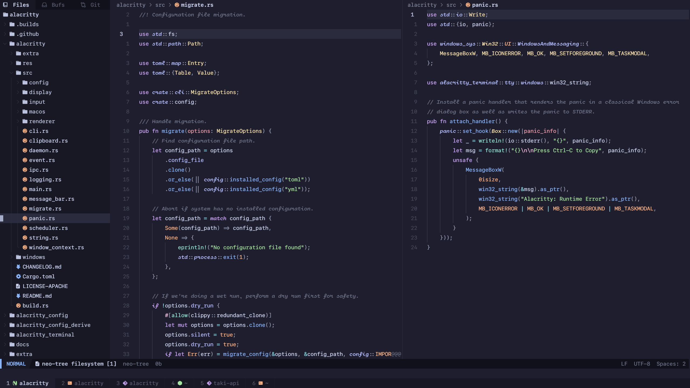

# <kbd>:cherry_blossom: dotfiles</kbd>

This repository contains my personal dotfiles, configurations, and scripts for customizing my development environment.

```md
- os: Windows 11
- ide: Neovim (nightly) / Visual Studio Code
- terminal: Windows Terminal
- shell: zsh
- theme: catppuccin
```


