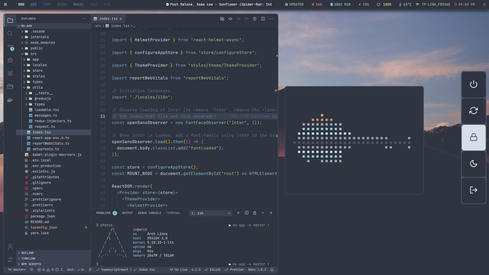

# ~/.dotfiles

## Details

- OS: Arch Linux
- WM: bspwm
- Shell: zsh (typewritten)
- Terminal: Alacritty
- Editor: Visual Studio Code, Neovim
- File Manager: nautilus
- Laucher: rofi
- Notification: Dunst
- Bar: Polybar
- Brower: Brave
